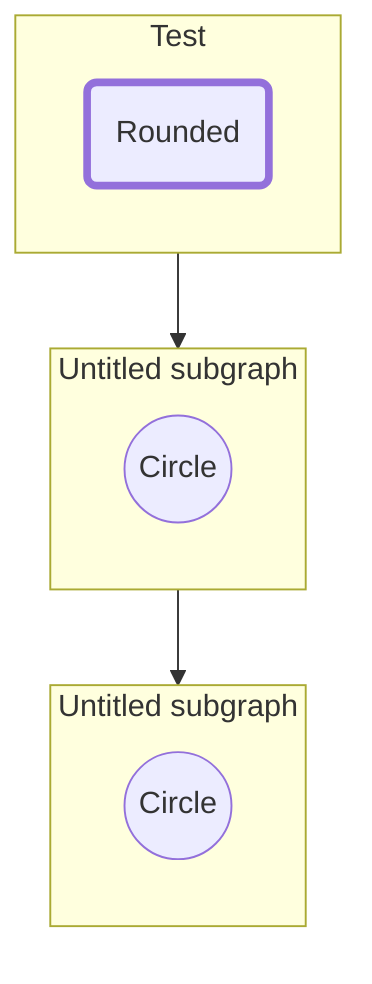

```mermaid
---
config:
  layout: fixed
---
flowchart TD
 subgraph s1["Test"]
        n15["Rounded"]
  end
 subgraph s2["Untitled subgraph"]
        n16(("Circle"))
  end
 subgraph s3["Untitled subgraph"]
        n17(("Circle"))
  end
    s1 --> s2
    s2 --> s3
    n15@{ shape: rounded}
    style n15 stroke-width:4px,stroke-dasharray: 0
    click n16 "[View File](2.md)"

```
