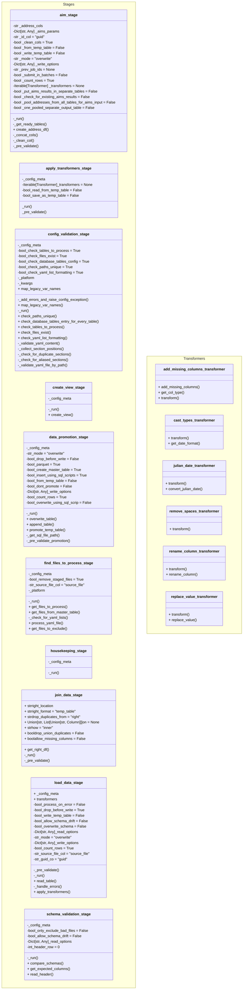

# Heading

- one
- two
- three

```mermaid
classDiagram
direction TB
	namespace Stages {
    
    class aim_stage {
	    -str _address_cols
	    -Dict[str, Any] _aims_params
	    -str _id_col = "guid"
	    -bool _clean_cols = True
	    -bool _from_temp_table = False
	    -bool _write_temp_table = False
	    -str _mode = "overwrite"
	    -Dict[str, Any] _write_options
	    -str _prev_job_ids = None
	    -bool _submit_in_batches = False
	    -bool _count_rows = True
	    -Iterable[Transformer] _transformers = None
	    -bool _put_aims_results_in_separate_tables = False
	    -bool _check_for_existing_aims_results = False
	    -bool _pool_addresses_from_all_tables_for_aims_input = False
	    -bool _one_pooled_separate_output_table = False
	    -_run()
	    -_get_ready_tables()
	    + create_address_df()
	    -_concat_cols()
	    -_clean_col()
	    -_pre_validate()
    }

    class apply_transformers_stage {
	    -_config_meta
	    -Iterable[Transformer]_transformers = None
	    -bool_read_from_temp_table = False
	    -bool_save_as_temp_table = False
	    _run()
	    _pre_validate()
    }

    class config_validation_stage {
	    -_config_meta
	    -bool_check_tables_to_process = True
	    -bool_check_files_exist = True
	    -bool_check_database_tables_config = True
	    -bool_check_paths_unique = True
	    -bool_check_yaml_list_formatting = True
	    -_platform
	    -_kwargs
	    + map_legacy_var_names
	    -_add_errors_and_raise_config_exception()
	    + map_legacy_var_names()
	    -_run()
	    + check_paths_unique()
	    + check_database_tables_entry_for_every_table()
	    + check_tables_to_process()
	    + check_files_exist()
	    + check_yaml_list_formatting()
	    -_validate_yaml_content()
	    -_collect_section_positions()
	    -_check_for_duplicate_sections()
	    -_check_for_aliased_sections()
	    -_validate_yaml_file_by_path()
    }

    class create_view_stage {
	    -_config_meta
	    -_run()
	    + create_view()
    }

    class data_promotion_stage {
	    -_config_meta
	    -str_mode = "overwrite"
	    -bool_drop_before_write = False
	    -bool_parquet = True
	    -bool_create_master_table = True
	    -bool_insert_using_sql_scripts = True
	    -bool_from_temp_table = False
	    -bool_dont_promote = False
	    -Dict[str, Any]_write_options
	    -bool_count_rows = True
	    -bool_overwrite_using_sql_scrip = False
	    -_run()
	    + overwrite_table()
	    + append_table()
	    + promote_temp_table()
	    -_get_sql_file_path()
	    -_pre_validate_promotion()
    }

    class find_files_to_process_stage {
	    -_config_meta
	    -bool_remove_staged_files = True
	    -str_source_file_col = "source_file"
	    -_platform
	    -_run()
	    + get_files_to_process()
	    + get_files_from_master_table()
	    -_check_for_yaml_lists()
	    + process_yaml_file()
	    + get_files_to_exclude()
    }

    class housekeeping_stage {
	    -_config_meta
	    -_run()
    }

    class join_data_stage {
	    + strright_location
	    + strright_format = "temp_table"
	    + strdrop_duplicates_from = "right"
	    + Union[str, List[Union[str, Column]]]on = None
	    + strhow = "inner"
	    + booldrop_union_duplicates = False
	    + boolallow_missing_columns = False
	    + get_right_df()
	    -_run()
	    -_pre_validate()
    }

    class load_data_stage {
	    + _config_meta
	    + transformers
	    -bool_process_on_error = False
	    -bool_drop_before_write = True
	    -bool_write_temp_table = False
	    -bool_allow_schema_drift = False
	    -bool_overwrite_schema = False
	    -Dict[str, Any]_read_options
	    -str_mode = "overwrite"
	    -Dict[str, Any]_write_options
	    -bool_count_rows = True
	    -str_source_file_col = "source_file"
	    -str_guid_co = "guid"
	    -_pre_validate()
	    -_run()
	    + read_table()
	    -_handle_errors()
	    + apply_transformers()
    }

    class schema_validation_stage {
	    -_config_meta
	    -bool_only_exclude_bad_files = False
	    -bool_allow_schema_drift = False
	    -Dict[str, Any]_read_options
	    -int_header_row = 0
	    -_run()
	    + compare_schemas()
	    + get_expected_columns()
	    + read_header()
    }
  }
  namespace Transformers {
    class add_missing_columns_transformer{
      + add_missing_columns()
      + get_col_type()
      + transform()
    }
    class cast_types_transformer{
      + transform()
      + get_date_format()
    }
    class julian_date_transformer{
      + transform()
      + convert_julian_date()
    }
    class remove_spaces_transformer{
      + transform()
    }
    class rename_column_transformer{
      + transform()
      + rename_column()
    }
    class replace_value_transformer{
      + transform()
      + replace_value()
    }
  }

```
