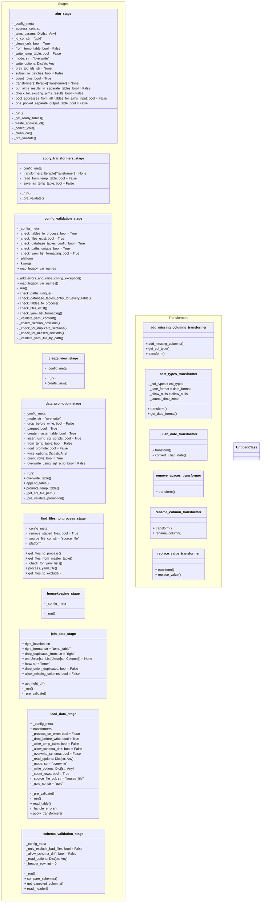

# Heading

- one
- two
- three

```mermaid
classDiagram
direction TB
	namespace Stages {
        class aim_stage {
	        - _config_meta
	        - _address_cols: str
	        - _aims_params: Dict[str, Any]
	        - _id_col: str = "guid"
	        - _clean_cols: bool = True
	        - _from_temp_table: bool = False
	        - _write_temp_table: bool = False
	        - _mode: str = "overwrite"
	        - _write_options: Dict[str, Any]
	        - _prev_job_ids: str = None
	        - _submit_in_batches: bool = False
	        - _count_rows: bool = True
	        - _transformers: Iterable[Transformer] = None
	        - _put_aims_results_in_separate_tables: bool = False
	        - _check_for_existing_aims_results: bool = False
	        - _pool_addresses_from_all_tables_for_aims_input: bool = False
	        - _one_pooled_separate_output_table: bool = False
	        - _run()
	        - _get_ready_tables()
	        + create_address_df()
	        - _concat_cols()
	        - _clean_col()
	        - _pre_validate()
        }
        class apply_transformers_stage {
	        - _config_meta
	        - _transformers: Iterable[Transformer] = None
	        - _read_from_temp_table: bool = False
	        - _save_as_temp_table: bool = False
	        - _run()
	        - _pre_validate()
        }
        class config_validation_stage {
			- _config_meta
			- _check_tables_to_process: bool = True
			- _check_files_exist: bool = True
			- _check_database_tables_config: bool = True
			- _check_paths_unique: bool = True
			- _check_yaml_list_formatting: bool = True
			- _platform
			- _kwargs
			+ map_legacy_var_names
	        -_add_errors_and_raise_config_exception()
	        + map_legacy_var_names()
	        -_run()
	        + check_paths_unique()
	        + check_database_tables_entry_for_every_table()
	        + check_tables_to_process()
	        + check_files_exist()
	        + check_yaml_list_formatting()
	        - _validate_yaml_content()
	        - _collect_section_positions()
	        - _check_for_duplicate_sections()
	        - _check_for_aliased_sections()
	        - _validate_yaml_file_by_path()
        }
        class create_view_stage {
	        - _config_meta
	        - _run()
	        + create_view()
        }
        class data_promotion_stage {
			- _config_meta
			- _mode: str = "overwrite"
			- _drop_before_write: bool = False
			- _parquet: bool = True
			- _create_master_table: bool = True
			- _insert_using_sql_scripts: bool = True
			- _from_temp_table: bool = False
			- _dont_promote: bool = False
			- _write_options: Dict[str, Any]
			- _count_rows: bool = True
			- _overwrite_using_sql_scrip: bool = False
	        - _run()
	        + overwrite_table()
	        + append_table()
	        + promote_temp_table()
	        - _get_sql_file_path()
	        - _pre_validate_promotion()
        }
        class find_files_to_process_stage {
			- _config_meta
			- _remove_staged_files: bool = True
			- _source_file_col: str = "source_file"
			- _platform
	        + get_files_to_process()
	        + get_files_from_master_table()
	        - _check_for_yaml_lists()
	        + process_yaml_file()
	        + get_files_to_exclude()
        }
        class housekeeping_stage {
	        - _config_meta
	        - _run()
        }
        class join_data_stage {
			+ right_location: str
			+ right_format: str = "temp_table"
			+ drop_duplicates_from: str = "right"
			+ on: Union[str, List[Union[str, Column]]] = None
			+ how: str = "inner"
			+ drop_union_duplicates: bool = False
			+ allow_missing_columns: bool = False
	        + get_right_df()
	        - _run()
	        - _pre_validate()
        }
        class load_data_stage {
			+ _config_meta
			+ transformers
			- _process_on_error: bool = False
			- _drop_before_write: bool = True
			- _write_temp_table: bool = False
			- _allow_schema_drift: bool = False
			- _overwrite_schema: bool = False
			- _read_options: Dict[str, Any]
			- _mode: str = "overwrite"
			- _write_options: Dict[str, Any]
			- _count_rows: bool = True
			- _source_file_col: str = "source_file"
			- _guid_co: str = "guid"
	        - _pre_validate()
	        - _run()
	        + read_table()
	        - _handle_errors()
	        + apply_transformers()
        }
        class schema_validation_stage {
			- _config_meta
			- _only_exclude_bad_files: bool = False
			- _allow_schema_drift: bool = False
			- _read_options: Dict[str, Any]
			- _header_row: int = 0
	        - _run()
	        + compare_schemas()
	        + get_expected_columns()
	        + read_header()
        }
	}
	namespace Transformers {
        class add_missing_columns_transformer {
	        + add_missing_columns()
	        + get_col_type()
	        + transform()
        }
        class cast_types_transformer {
	        - _col_types = col_types
			- _date_format = date_format
			- _allow_nulls = allow_nulls
			- _source_time_zone
			+ transform()
	        + get_date_format()
        }
        class julian_date_transformer {
	        + transform()
	        + convert_julian_date()
        }
        class remove_spaces_transformer {
	        + transform()
        }
        class rename_column_transformer {
	        + transform()
	        + rename_column()
        }
        class replace_value_transformer {
	        + transform()
	        + replace_value()
        }
	}
    class UntitledClass {
    }


```
