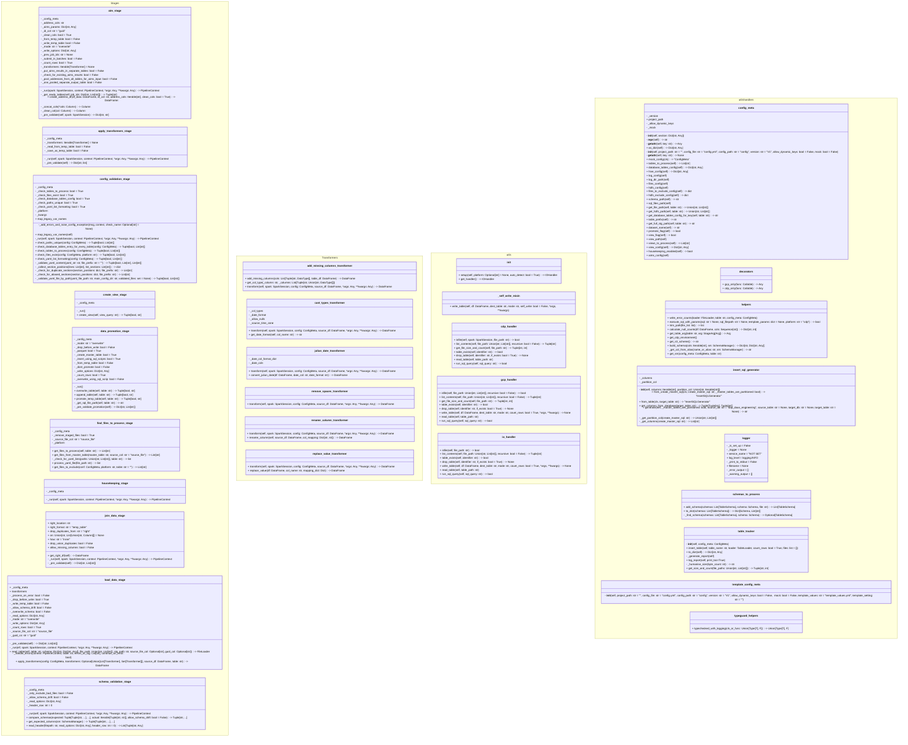

# Heading

- one
- two
- three

```mermaid
classDiagram
direction TB
	namespace Stages {
        class aim_stage {
	        - _config_meta
	        - _address_cols: str
	        - _aims_params: Dict[str, Any]
	        - _id_col: str = "guid"
	        - _clean_cols: bool = True
	        - _from_temp_table: bool = False
	        - _write_temp_table: bool = False
	        - _mode: str = "overwrite"
	        - _write_options: Dict[str, Any]
	        - _prev_job_ids: str = None
	        - _submit_in_batches: bool = False
	        - _count_rows: bool = True
	        - _transformers: Iterable[Transformer] = None
	        - _put_aims_results_in_separate_tables: bool = False
	        - _check_for_existing_aims_results: bool = False
	        - _pool_addresses_from_all_tables_for_aims_input: bool = False
	        - _one_pooled_separate_output_table: bool = False
	        - _run(spark: SparkSession, context: PipelineContext, *args: Any, **kwargs: Any) -> PipelineContext
	        - _get_ready_tables(self, job_ids: Dict[str, List[str]]) -> Tuple[str]
	        + create_address_df(df_data: DataFrame, id_col: str, address_cols: Iterable[str], clean_cols: bool = True) -> DataFrame:
	        - _concat_cols(*cols: Column) -> Column
	        - _clean_col(col: Column) -> Column
	        - _pre_validate(self, spark: SparkSession) -> Dict[str, str]
        }
        class apply_transformers_stage {
	        - _config_meta
	        - _transformers: Iterable[Transformer] = None
	        - _read_from_temp_table: bool = False
	        - _save_as_temp_table: bool = False
	        - _run(self, spark: SparkSession, context: PipelineContext, *args: Any, **kwargs: Any) -> PipelineContext
	        - _pre_validate(self) -> Dict[str, list]
        }
        class config_validation_stage {
			- _config_meta
			- _check_tables_to_process: bool = True
			- _check_files_exist: bool = True
			- _check_database_tables_config: bool = True
			- _check_paths_unique: bool = True
			- _check_yaml_list_formatting: bool = True
			- _platform
			- _kwargs
			+ map_legacy_var_names
	        -_add_errors_and_raise_config_exception(msg, context, check_name: Optional[str] = None)
	        + map_legacy_var_names(self)
	        -_run(self, spark: SparkSession, context: PipelineContext, *args: Any, **kwargs: Any) -> PipelineContext
	        + check_paths_unique(config: ConfigMeta) -> Tuple[bool, List[str]]
	        + check_database_tables_entry_for_every_table(config: ConfigMeta) -> Tuple[bool, List[str]]
	        + check_tables_to_process(config: ConfigMeta) -> Tuple[bool, List[str]]
	        + check_files_exist(config: ConfigMeta, platform: str) -> Tuple[bool, List[str]]
	        + check_yaml_list_formatting(config: ConfigMeta) -> Tuple[bool, List[str]]
	        - _validate_yaml_content(yaml_str: str, file_prefix: str = "") -> Tuple[bool, List[str], List[str]]
	        - _collect_section_positions(lines: List[str], list_sections: List[str]) -> dict
	        - _check_for_duplicate_sections(section_positions: dict, file_prefix: str) -> List[str]
	        - _check_for_aliased_sections(section_positions: dict, file_prefix: str) -> List[str]
	        - _validate_yaml_file_by_path(yaml_file_path: str, main_config_dir: str, validated_files: set = None) -> Tuple[bool, List[str]]
        }
        class create_view_stage {
	        - _config_meta
	        - _run()
	        + create_view(self, view_query: str) -> Tuple[bool, str]
        }
        class data_promotion_stage {
			- _config_meta
			- _mode: str = "overwrite"
			- _drop_before_write: bool = False
			- _parquet: bool = True
			- _create_master_table: bool = True
			- _insert_using_sql_scripts: bool = True
			- _from_temp_table: bool = False
			- _dont_promote: bool = False
			- _write_options: Dict[str, Any]
			- _count_rows: bool = True
			- _overwrite_using_sql_scrip: bool = False
	        - _run()
	        + overwrite_table(self, table: str) -> Tuple[bool, str]
	        + append_table(self, table: str) -> Tuple[bool, str]
	        + promote_temp_table(self, table: str) -> Tuple[bool, str]
	        - _get_sql_file_path(self, table: str) -> str:
	        - _pre_validate_promotion(self) -> Dict[str, List[str]]
        }
        class find_files_to_process_stage {
			- _config_meta
			- _remove_staged_files: bool = True
			- _source_file_col: str = "source_file"
			- _platform
	        + get_files_to_process(self, table: str) -> List[str]
	        + get_files_from_master_table(master_table: str, source_col: str = "source_file") -> List[str]
	        - _check_for_yaml_lists(paths: Union[str, List[str]], table: str) -> list
	        + process_yaml_file(file_path: str) -> list
	        + get_files_to_exclude(conf: ConfigMeta, platform: str, table: str = "") -> List[str]
        }
        class housekeeping_stage {
	        - _config_meta
	        - _run(self, spark: SparkSession, context: PipelineContext, *args: Any, **kwargs: Any) -> PipelineContext
        }
        class join_data_stage {
			+ right_location: str
			+ right_format: str = "temp_table"
			+ drop_duplicates_from: str = "right"
			+ on: Union[str, List[Union[str, Column]]] = None
			+ how: str = "inner"
			+ drop_union_duplicates: bool = False
			+ allow_missing_columns: bool = False
	        + get_right_df(self) -> DataFrame
	        - _run(self, spark: SparkSession, context: PipelineContext, *args: Any, **kwargs: Any) -> PipelineContext
	        - _pre_validate(self) -> Dict[str, List[str]]
        }
        class load_data_stage {
			+ _config_meta
			+ transformers
			- _process_on_error: bool = False
			- _drop_before_write: bool = True
			- _write_temp_table: bool = False
			- _allow_schema_drift: bool = False
			- _overwrite_schema: bool = False
			- _read_options: Dict[str, Any]
			- _mode: str = "overwrite"
			- _write_options: Dict[str, Any]
			- _count_rows: bool = True
			- _source_file_col: str = "source_file"
			- _guid_co: str = "guid"
	        - _pre_validate(self) -> Dict[str, List[str]]
	        - _run(elf, spark: SparkSession, context: PipelineContext, *args: Any, **kwargs: Any) -> PipelineContext
	        + read_table(self, table: str, schema: Dict[str, Dict[str, Any]], file_path: Union[str, List[str]], stg_path: str, source_file_col: Optional[str], guid_col: Optional[str]) -> FileLoader
	        - _handle_errors(context: PipelineContext, table: str, errors_to_log: List[str], continue_on_error: bool)
	        + apply_transformers(config: ConfigMeta, transformers: Optional[Union[List[Transformer], Set[Transformer]]], source_df: DataFrame, table: str) -> DataFrame
        }
        class schema_validation_stage {
			- _config_meta
			- _only_exclude_bad_files: bool = False
			- _allow_schema_drift: bool = False
			- _read_options: Dict[str, Any]
			- _header_row: int = 0
	        - _run(self, spark: SparkSession, context: PipelineContext, *args: Any, **kwargs: Any) -> PipelineContext
	        + compare_schemas(expected: Tuple[Tuple[str, ...], ...], actual: Iterable[Tuple[str, str]], allow_schema_drift: bool = False) -> Tuple[str, ...]
	        + get_expected_columns(sm: SchemaManager) -> Tuple[Tuple[str, ...], ...]
	        + read_header(filepath: str, read_options: Dict[str, Any], header_row: int = 0) -> List[Tuple[str, Any]
        }
	}
	namespace Transformers {
        class add_missing_columns_transformer {
	        + add_missing_columns(cols: List[Tuple[str, DataType]], table_df: DataFrame) -> DataFrame
	        + get_col_type(_column: str, _columns: List[Tuple[str, Union[str, DataType]]])
	        + transform(self, spark: SparkSession, config: ConfigMeta, source_df: DataFrame, *args: Any, **kwargs: Any) -> DataFrame
        }
        class cast_types_transformer {
	        - _col_types
			- _date_format
			- _allow_nulls
			- _source_time_zone
			+ transform(self, spark: SparkSession, config: ConfigMeta, source_df: DataFrame, *args: Any, **kwargs: Any) -> DataFrame
	        + get_date_format(self, col_name: str) -> str
        }
        class julian_date_transformer {
			- 	_date_col_format_dict
			- 	_date_cols
			+ transform(self, spark: SparkSession, config: ConfigMeta, source_df: DataFrame, *args: Any, **kwargs: Any) -> DataFrame
	        + convert_julian_date(df: DataFrame, date_col: str, date_format: str) -> DataFrame
        }
        class remove_spaces_transformer {
			+ transform(self, spark: SparkSession, config: ConfigMeta, source_df: DataFrame, *args: Any, **kwargs: Any) -> DataFrame
        }
        class rename_column_transformer {
			+ transform(self, spark: SparkSession, config: ConfigMeta, source_df: DataFrame, *args: Any, **kwargs: Any) -> DataFrame
	        + rename_column(self, source_df: DataFrame, col_mapping: Dict[str, str]) -> DataFrame
        }
        class replace_value_transformer {
			+ transform(self, spark: SparkSession, config: ConfigMeta, source_df: DataFrame, *args: Any, **kwargs: Any) -> DataFrame
	        + replace_value(df: DataFrame, col_name: str, mapping_dict: Dict) -> DataFrame
        }
	}
	namespace utils {
		class __init__ {
			+ setup(self, platform: Optional[str] = None, auto_detect: bool = True) -> IOHandler 
			+ get_handler() -> IOHandler
		}
		class _self_write_mixin{
			+ write_table(self, df: DataFrame, dest_table: str, mode: str, self_write: bool = False, *args, **kwargs)
		}
		class cdp_handler{
			+ isfile(self, spark: SparkSession, file_path: str) -> bool
			+ list_contents(self, file_path: Union[str, List[str]], recursive: bool = False) -> Tuple[str]
			+ get_file_size_and_count(self, file_path: str) -> Tuple[int, int]
			+ table_exists(self, identifier: str) -> bool
			+ drop_table(self, identifier: str, if_exists: bool = True) -> None
			+ read_table(self, table_path: str)
			+ run_sql_query(self, sql_query: str) -> bool
		}
		class gcp_handler{
			+ isfile(self, file_path: Union[str, List[str]], recursive: bool = False) -> bool
			+ list_contents(self, file_path: Union[str, List[str]], recursive: bool = False) -> Tuple[str]
			+ get_file_size_and_count(self, file_path: str) -> Tuple[int, int]
			+ table_exists(self, identifier: str) -> bool
			+ drop_table(self, identifier: str, if_exists: bool = True) -> None
			+ write_table(self, df: DataFrame, dest_table: str, mode: str, count_rows: bool = True, *args, **kwargs) -> None
			+ read_table(self, table_path: str)
			+ run_sql_query(self, sql_query: str) -> bool
		}
		class io_handler{
			+ isfile(self, file_path: str) -> bool
			+ list_contents(self, file_path: Union[str, List[str]], recursive: bool = False) -> Tuple[str]
			+ table_exists(self, identifier: str) -> bool
			+ drop_table(self, identifier: str, if_exists: bool = True) -> None
			+ write_table(self, df: DataFrame, dest_table: str, mode: str, count_rows: bool = True, *args, **kwargs) -> None
			+ read_table(self, table_path: str)
			+ run_sql_query(self, sql_query: str) -> bool
		}

	}

	namespace utils handlers {
		class config_meta {
			- 	_version
			+ 	project_path
			- 	_allow_dynamic_keys
			- 	_mock
			- 	__init__(self, section: Dict[str, Any])
			- 	__repr__(self) -> str
			- 	__getattr__(self, key: str) -> Any
			+ 	as_dict(self) -> Dict[str, Any]
			- 	__init__(self, project_path: str = "", config_file: str = "config.yml", config_path: str = "config", version: str = "V1", allow_dynamic_keys: bool = False, mock: bool = False)
			- 	__getattr__(self, key: str) -> None
			+ 	mock_config(cls) -> "ConfigMeta"
			+ 	tables_to_process(self) -> List[str]
			+ 	database_tables_config(self) -> Dict[str, Any]
			+ 	hive_config(self) -> Dict[str, Any]
			+ 	log_config(self)
			+ 	log_dir_path(self)
			+ 	files_config(self)
			+ 	hdfs_config(self)
			+ 	files_to_exclude_config(self) -> dict
			+ 	hdfs_exclude_config(self) -> dict
			+ 	schema_path(self) -> str
			+ 	sql_files_path(self)
			+ 	get_file_path(self, table: str) -> Union[str, List[str]]
			+ 	get_hdfs_path(self, table: str) -> Union[str, List[str]]
			+ 	get_database_tables_config_for_key(self, table: str) -> str
			+ 	table_prefix(self) -> str
			+ 	get_full_stg_path(self, table: str) -> str
			+ 	dataset_name(self) -> str
			+ 	promote_flag(self) -> bool
			+ 	view_flag(self) -> bool
			+ 	view_path(self)
			+ 	views_to_process(self) -> List[str]
			+ 	view_config(self) -> Dict[str, Any]
			+ 	housekeeping_enabled(self) -> bool
			+ 	aims_config(self)
		}
		class decorators {
			+ 	gcp_only(func: Callable) -> Any
			+ 	cdp_only(func: Callable) -> Any

		}

		class helpers {
			+ 	write_error_counts(loader: FileLoader, table: str, config_meta: ConfigMeta)
			+ 	execute_sql_with_params(sql: str = None, sql_filepath: str = None, template_params: dict = None, platform: str = "cdp") -> bool
			+ 	trim_path(file_list: list) -> list
			+ 	calculate_null_counts(df: DataFrame, cols: Sequence[str]) -> Dict[str, int]
			+ 	get_table_arg(table: str, arg: StageArg[Arg]) -> Arg
			+ 	get_cdp_environment()
			+ 	get_s3_scheme() -> str
			+ 	build_schema(cols: Iterable[str], sm: SchemaManager) -> Dict[str, Dict[str, Any]]
			- 	_get_col_from_alias(name_or_alias: str, sm: SchemaManager) -> str
			+ 	get_sm(config_meta: ConfigMeta, table: str)
		}

		class insert_sql_generator {
			- 	_columns
			- 	_partition_col
			- 	__init__(self, columns: Iterable[str], partition_col: Union[str, Iterable[str]])
			+ 	from_create_master_sql(cls, create_master_sql: str, _master_tables_are_partitioned: bool) -> "InsertSQLGenerator"
			+ 	from_table(cls, target_table: str) -> "InsertSQLGenerator"
			+ 	get_columns_from_database(target_table: str) -> Tuple[Tuple[str], Tuple[str]]
			+ 	generate(self, _master_tables_are_partitioned: bool, source_db: str = "dap_daas_engineering", source_table: str = None, target_db: str = None, target_table: str = None) -> str
			- 	_get_partition_col(create_master_sql: str) -> Union[str, List[str]]
			- 	_get_columns(create_master_sql: str) -> List[str]
		}

		class logger {
			- 	_is_set_up = False
			- 	_logger = None
			+ 	service_name = "NOT SET"
			+ 	log_level = logging.INFO
			- 	_print_to_stdout = False
			+ 	filename = None
			- 	_error_output = []
			- 	_warning_output = []
		}

		class schemas_to_process {
			+ 	add_schema(schemas: List[TableSchema], schema: Schema, file: str) -> List[TableSchema]
			+ 	to_dict(schemas: List[TableSchema]) -> Dict[Schema, List[str]]
			- 	_find_schema(schemas: List[TableSchema], schema: Schema) -> Optional[TableSchema]
		}

		class table_tracker {
			- 	__init__(self, config_meta: ConfigMeta)
			+ 	insert_table(self, table_name: str, loader: TableLoader, count_rows: bool = True, files: list = [])
			+ 	to_dict(self) -> Dict[str, Any]
			- 	_generate_report(self)
			+ 	log_report(self, print_too=True)
			- 	_humanise_size(byte_count: int) -> str
			+ 	get_size_and_count(file_paths: Union[str, List[str]]) -> Tuple[str, int]
		}

		class template_config_meta {
			- 	__init__(self, project_path: str = "", config_file: str = "config.yml", config_path: str = "config", version: str = "V1", allow_dynamic_keys: bool = False,  mock: bool = False, template_values: str = "template_values.yml", template_setting: str = "")
		}

		class typeguard_helpers {
			+ 	typechecked_with_logging(cls_or_func: Union[Type[T], F]) -> Union[Type[T], F]
		}

	}


```
