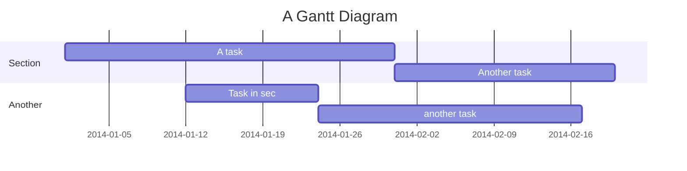

```mermaid
classDiagram
    class ConfigMeta {
        project_path: String
        config_file: String
        config_path: String
        version: string
        allow_dynamic_keys: Bool
        mock: Bool
        -getattr()
        mock_config()
        tables_to_process()
        database_tables_config()
        hive_config()
        log_config()
        log_dir_path()
        files_config()
        hdfs_config()
        files_to_exclude_config()
        hdfs_exclude_config()
        schema_path()
        sql_files_path()
        get_file_path()
        get_hdfs_path()
        get_database_tables_config_for_key
        table_prefix()
        get_full_stg_path()
        dataset_name()
        promote_flag()
        view_flag()
        view_path()
        views_to_process()
        view_config()
        housekeeping_enabled()
        aims_config()


    }

    class InsertSQLGenerator {
        columns: Iterable[str]
        partition_col: Union[str, Iterable[str]]
        from_create_master_sql()
        from_table()
        get_columns_from_database()
        generate()
        -get_partition_col()
        -get_columns()

    }

    class SchemasToProcess {
        schemas: List[TableSchema]
        schema: Schema, 
        file: String
        to_dict()
        -find_schema()
    }

    classA <|-- classB
    classC *-- classD
    classE o-- classF
    classG <-- classH
    classI -- classJ
    classK <.. classL
    classM <|.. classN
    classO .. classP

gantt
    dateFormat  YYYY-MM-DD
    title       Adding GANTT diagram functionality to mermaid
    excludes    weekends
    %% (`excludes` accepts specific dates in YYYY-MM-DD format, days of the week ("sunday") or "weekends", but not the word "weekdays".)

    section A section
    Completed task            :done,    des1, 2014-01-06,2014-01-08
    Active task               :active,  des2, 2014-01-09, 3d
    Future task               :         des3, after des2, 5d
    Future task2              :         des4, after des3, 5d

    section Critical tasks
    Completed task in the critical line :crit, done, 2014-01-06,24h
    Implement parser and jison          :crit, done, after des1, 2d
    Create tests for parser             :crit, active, 3d
    Future task in critical line        :crit, 5d
    Create tests for renderer           :2d
    Add to mermaid                      :until isadded
    Functionality added                 :milestone, isadded, 2014-01-25, 0d

    section Documentation
    Describe gantt syntax               :active, a1, after des1, 3d
    Add gantt diagram to demo page      :after a1  , 20h
    Add another diagram to demo page    :doc1, after a1  , 48h

    section Last section
    Describe gantt syntax               :after doc1, 3d
    Add gantt diagram to demo page      :20h
    Add another diagram to demo page    :48h

```

# Heading

- one
- two
- three

section Section
A task           :a1, 2014-01-01, 30d
Another task     :after a1  , 20d
section Another
Task in sec      :2014-01-12  , 12d
anther task      : 24d

gantt
    title A Gantt Diagram

    section Section
    A task           :a1, 2014-01-01, 30d
    Another task     :after a1  , 20d
    section Another
    Task in sec      :2014-01-12  , 12d
    anther task      : 24d

